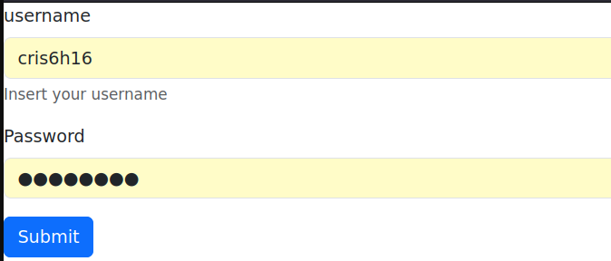
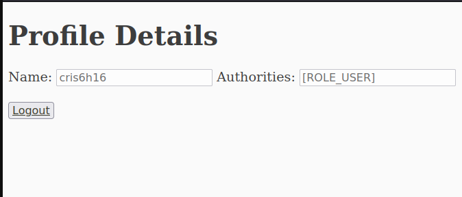

**PD:** this repo is only an example...   


## screenshots:
1. GET `/`  
  

#

2. GET `/login`  

```java
UserDetails user = User.withDefaultPasswordEncoder() // you can do your own impl for add more attributes
                .username("cris6h16")
                .password("cris6h16") // password is stored encrypted
                .roles("USER")
                .build();
```
#
3. GET `/auth/info` (logged in)      

#
3. GET `/logout` (logged in isn't necessary)   

